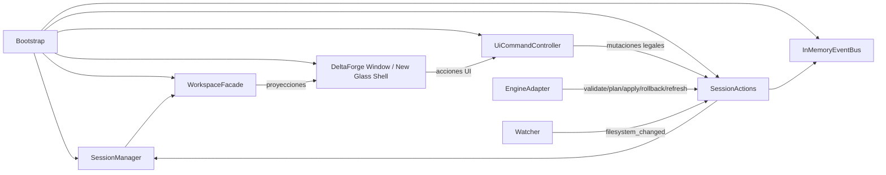

# DeltaForge · Mapa de Paridad 1:1 del Motor y Corte de GUI hacia la nueva shell

> Generado a partir de los paquetes subidos `deltaforge.zip` y `shared (3).zip`.
>
> Base de lectura principal:
>
> - `apps/deltaforge/README.md`
> - `apps/deltaforge/docs/maestro_handoff/MASTER_ARCHITECTURE.md`
> - `apps/deltaforge/docs/maestro_handoff/FROZEN_CONTRACTS.md`
> - `apps/deltaforge/docs/core_session_integrity/01_CORE_SESSION_INTEGRITY_OWNERSHIP_MATRIX.md`
> - `apps/deltaforge/application/*`
> - `apps/deltaforge/domain/*`
> - `apps/deltaforge/ui/*`
> - `forgeos/shared/pyside6_glass/ARCHITECTURE.md`
> - `forgeos/shared/pyside6_glass/INTEGRATION.md`
> - `forgeos/shared/pyside6_glass/template.py`
> - `forgeos/shared/pyside6_glass/runtime.py`

---

## Veredicto ejecutivo

DeltaForge **ya tiene el motor suficientemente separado** para migrar la carcasa visual a la nueva shell sin tocar el core.  
La jugada correcta es esta:

**DeltaForge Core -> WorkspaceFacade / UiCommandController -> Adapter DeltaForge -> Glass -> PySide6 Glass Shell**

No esta otra:

**DeltaForge Core -> shared integration runtime -> widgets -> estado híbrido**

El motor real hoy vive en la combinación de:

- `SessionWorkspace` como verdad por sesión
- `SessionManager` como owner de colección y sesión activa
- `SessionActions` como únicos mutadores legales
- `WorkspaceFacade` como superficie de lectura/proyección
- `UiCommandController` como entrada de acciones UI
- `EngineAdapter` y watcher como infraestructura periférica

La GUI actual **ya está medio migrada** al shared, pero **solo en primitivas visuales**:
usa `build_glass_dialog_scene`, `create_button`, `apply_icon` y `GlassWorkspaceTabs`.  
Eso significa que la compatibilidad visual ya existe, pero la shell **todavía no está montada estructuralmente** sobre `GlassPanelTemplate` + `GlassWorkspaceRuntime`.

---

## Regla madre del sistema

La verdad operativa vive en la **sesión sobre un scope**.

Eso implica:

1. La shell nueva **no** puede quedarse con estado de negocio.
2. `pyside6_glass` debe actuar como **host visual** y runtime de layout.
3. La traducción correcta ocurre en un **adapter de proyecciones**, no en widgets sueltos.
4. `integration/*` de shared debe quedar como frontera aditiva para clientes externos, no como spine interno de DeltaForge.

---

## Corte arquitectónico recomendado

### Lo que se conserva intacto

- `domain/*`
- `application/*`
- `infrastructure/*`
- contratos `EngineAdapter`, `EventBus`, `SessionRepository`
- ownership de `SessionWorkspace`
- transiciones de `state_machine.py`
- dirty/stale/refresh policies

### Lo que se reemplaza

- shell visual de `ui/window/main_window.py`
- splitters y composición manual de layout
- barra/status/superficies como wiring directo de ventana

### Lo que se envuelve

- `WorkspaceFacade`
- `UiCommandController`
- `ui/window/interop.py`
- `ui/adapters/glass_framework_adapter.py`

### Lo que no debe volverse dueño del sistema

- `forgeos/shared/pyside6_glass/integration/*`

---

## Flujo end-to-end del motor



---

## Mapa maestro de paridad 1:1 del motor

| Pieza actual | Capa | Qué hace hoy | Regla dura | Destino en la shell nueva | Adapter requerido | Decisión |
| --- | --- | --- | --- | --- | --- | --- |
| `bootstrap/app_bootstrap.py` | Bootstrap / runtime entry | Crea `QApplication`, arma `SessionManager` + `InMemoryEventBus` + `SessionActions` + `WorkspaceFacade` + `UiCommandController`, crea sesión inicial y levanta `DeltaForgeMainWindow`. | Nada de negocio debe subirse a la shell nueva. Este wiring se conserva. | `GlassPanelTemplate` + `GlassWorkspaceRuntime` solo como host visual, no como owner del motor. | Adapter de arranque: sustituir la ventana actual por una shell glass completa, pero inyectando los mismos bindings. | Preservar |
| `domain/models/session.py::SessionWorkspace` | Verdad operativa por sesión | Contiene `scope`, `ops_document`, `state`, `dirty`, `stale`, `busy`, `selection`, `event_feed`, resultados y tokens de rollback. | Es la ley del sistema. No se fragmenta. | No tiene equivalente directo en shared, porque shared no debe ser dueño de negocio. | Adapter de proyección: traducir este workspace a tabs, paneles y status sin duplicar estado. | Preservar |
| `application/session_manager.py::SessionManager` | Owner de colección de sesiones | Crea, agrega, muta, clona, activa y cierra sesiones. Guarda `active_session_id` y colección viva. | La shell nueva no puede inventarse otra noción de sesión. | `GlassWorkspaceTabs` puede representar tabs, pero no sustituye al manager. | Mapeo `SessionManager -> tab specs` y eventos de selección. | Preservar |
| `application/session_actions.py::SessionActions` | Mutadores legales | Centraliza create/clone/activate/close, scope, ops, dirty/stale, runs, refresh, selección y results. | Aquí viven las mutaciones legales. No en widgets. | Shared no trae lógica de negocio equivalente. | El adapter solo dispara acciones y vuelve a pedir proyecciones. | Preservar |
| `application/state_machine.py` | Policía de transiciones | Estados canónicos: `NEW`, `IDLE`, `DIRTY_OR_STALE`, `VALIDATING`, `PLANNING`, `APPLYING`, `ROLLING_BACK`, `REFRESHING`, `FAILED`, `CLOSED`. | No mezclar estos estados con estados visuales de panel/tab. | Shared tiene `tab state` y `panel state`, pero son visuales, no operativos. | Tabla de traducción: estado de sesión -> badge/estado visual. | Preservar |
| `application/workspace_facade.py::WorkspaceFacade` | Superficie de lectura | Genera `status`, `selection`, `results`, `session_tabs`, `command_bar`, `scope` y `workspace_projection`. | Es el punto correcto para extraer la UI actual hacia la nueva shell. | Shared consume mejor `tab specs`, `panel specs`, status y layout state. | Adapter principal: `WorkspaceFacade -> Glass shell projections`. | Preservar |
| `application/controllers/ui_command_controller.py::UiCommandController` | Puente UI -> motor | Expone acciones `create_session`, `close_session`, `select_session`, `browse_root_dir`, `validate_active`, `plan_active`, `apply_active`, `rollback_active`, `refresh_active`, `select_op`, `select_target`. | La nueva UI debe seguir entrando por aquí o por un wrapper 1:1 equivalente. | Shared integration trae comandos neutrales, pero no son el flujo local principal. | Mantener acción por acción; solo cambiar quién llama. | Preservar |
| `infrastructure/adapters/mock_engine.py::MockEngineAdapter` | Engine mock / contrato | Devuelve `ValidationResult`, `PlanResult`, `ApplyResult`, `RollbackResult`, `RefreshResult`, además de `load_ops` y `save_ops`. | El shell no toca engine directo. | Sin equivalente en shared. | Se mantiene detrás de `EngineAdapter`. | Preservar |
| `infrastructure/file_watcher_polling.py` + `infrastructure/watcher.py` | Señal externa | Detecta cambios del filesystem y emite señal. El watcher no debe decidir el estado final; solo señala. | No convertir el runtime visual en watcher owner. | Shared runtime puede esconder/mostrar paneles, no decidir `stale`. | Adapter de eventos visuales, no de verdad operativa. | Preservar |
| `ui/window/main_window.py` | Shell actual | Compone tabs, command bar, workspace y status strip. Ya usa piezas de `pyside6_glass` como `build_glass_dialog_scene`, `create_button`, `apply_icon`, `GlassWorkspaceTabs`. | La UI actual ya está medio injertada al shared, pero no montada sobre `GlassPanelTemplate`/`GlassWorkspaceRuntime`. | `GlassPanelTemplate` + `GlassWorkspaceRuntime` son el host correcto. | Reemplazar shell y conservar señales + bindings. | Reemplazar visualmente |
| `ui/adapters/glass_framework_adapter.py` | Adapter actual de shared | Registra icon pack DeltaForge y devuelve `GlassTemplateConfig` default para la app. | Ya existe una punta del adapter. Falta que sea el host real de la app, no solo wiring cosmético. | Config, theme y tabs del framework. | Expandirlo para crear la shell nueva completa. | Extender |
| `shared/pyside6_glass/template.py` | Shell/tabs/paneles/layout | Define `GlassWorkspaceTabSpec`, `GlassPanelSpec`, `GlassWorkspaceTabs`, `GlassPanelTemplate` y control de layout. | Esto sí puede sustituir la carcasa actual. | Host principal de la nueva UI. | Mapear `session/workspace/status/results` a paneles y tabs del template. | Adoptar |
| `shared/pyside6_glass/runtime.py` | Orquestación visual | Gestiona config resuelta, presets, layouts, visibilidad, shortcuts y persistencia de workspace state. | Debe ser dueño del runtime visual, no del negocio. | Runtime de shell. | Conectarlo encima del adapter de proyecciones. | Adoptar |
| `shared/pyside6_glass/integration/*` | Frontera neutra externa | Comandos/queries/snapshots/eventos para clientes ligeros externos. | No usar esto como columna vertebral interna de DeltaForge. | Solo útil si luego quieres web/mobile/automation externos. | Mantener fuera del core local; usar solo como add-on. | No usar como owner del motor |

---

## Ownership matrix operativo que no se debe romper

| Dato / señal | Owner | Lectores | Mutadores legales | Prohibido |
| --- | --- | --- | --- | --- |
| `scope` | `SessionWorkspace` | Facade, panes, controller, policies | Creación de sesión y cambios explícitos de scope desde application | Nunca desde widgets, watcher o `main_window` |
| `ops_document` | `SessionWorkspace` | Panel ops, plan/diff/results projection, facade/controller | Acciones explícitas de edición/carga/reemplazo desde application | Nunca desde editor local o cache de UI |
| `dirty` | `SessionWorkspace` | Status, tabs, panes, facade/controller, policies | Política de sesión ante edición semántica | Nunca desde flags locales de pane o event bus |
| `stale` | `SessionWorkspace` | Status, refresh policy, panes, facade/controller | Política de sesión a partir de señales externas | Nunca desde watcher como verdad final |
| `busy` | `SessionWorkspace` | Panes, status, command gating | Runs transaccionales en application | Nunca desde spinner/dialog/widget |
| `session_state` | `SessionWorkspace` | Tabs, panes, status, facade/controller | State machine + session actions | Nunca desde widgets o adapter visual |
| `validation_result` / `plan_result` / `apply_result` / `rollback_result` | `SessionWorkspace` | Bottom tabs, detail, center view, status summary | Flows de application al completar operación | Nunca desde caches de pane o singletons |
| `active_session_id` | `SessionManager` | `main_window`, tabs, facade/controller, panes vía proyección | Selección/creación/cierre de sesión | Nunca desde tabs locales |
| `session_collection` | `SessionManager` | `main_window`, session tabs, facade/controller | Create/clone/close actions | Nunca desde persistence como verdad viva |
| `pane_layout_state` | UI/runtime visual | `main_window`, template/runtime | Shell/layout restore flows | Nunca en domain o session core |

---

## Mapa de comandos 1:1

| Acción UI | Origen | Ruta legal | Efecto en motor | Paridad en shell nueva |
| --- | --- | --- | --- | --- |
| `create_session` | UI -> controller | `SessionActions.create_session` | Nueva sesión + tab activo | Crear tab `session:<id>` |
| `close_session` | UI -> controller | `SessionActions.close_session` | Cierra sesión y reelige activa | Cerrar tab y refrescar status |
| `select_session` | Tabs -> controller | `SessionActions.activate_session` | Activa sesión | Cambiar tab activo |
| `browse_root_dir` | Command bar | `ScopeSelection.for_directory` + `SessionActions.set_scope` + `update_selection` | Carga scope y detalle | Actualizar panel scope/targets/status |
| `validate_active` | Command bar | `start_run(VALIDATING)` -> `complete_run(surface=validation)` | Validation result | Pintar tab `validation` |
| `plan_active` | Command bar | `start_run(PLANNING)` -> `complete_run(surface=plan)` | Plan result + preview | Pintar center preview y tab `plan` |
| `apply_active` | Command bar | `start_run(APPLYING)` -> `complete_run(surface=apply)` | Apply result | Pintar tab `apply` |
| `rollback_active` | Command bar | `start_run(ROLLING_BACK)` -> `complete_run(surface=rollback)` | Rollback result | Pintar tab `rollback` |
| `refresh_active` | Command bar | `begin_refresh` -> `finish_refresh` | Refresh result + limpia stale | Actualizar status y event feed |
| `select_op` | Ops list | `update_selection(op=..., detail=..., surface=plan)` | Detalle de operación | Cambiar detail pane + foco plan |
| `select_target` | Target list | `update_selection(targets=..., detail=..., surface=events)` | Detalle de target | Cambiar detail pane + foco events |

---

## Mapa de proyecciones 1:1

| Projection / snapshot | Payload actual | Destino visual | Regla del adapter |
| --- | --- | --- | --- |
| `get_session_tabs_projection()` | Lista de sesiones con `id`, `title`, `badge`, `state`, `dirty`, `stale`, `current`. | `GlassWorkspaceTabSpec[]` | `tab_id=session_id`, `title`, `badge`, `state` visual, `tooltip`, `status` |
| `get_command_bar_projection()` | Estado de root, mode, busy y enablement de acciones. | Toolbar / action strip | Botones y disabled-state; no guarda negocio |
| `get_status_projection()` | Payload de status bar con root, target_count, session_state, mode, dirty/stale/busy. | Status/footer panel | Badges, summary strip y status text |
| `get_scope_projection()` | Scope tipado, path, targets, watch_paths y metadata. | Panel lateral de scope/targets | Lista de targets + metadata |
| `get_workspace_projection()` | Paquete rico: `targets`, `ops`, `grouped_preview`, `detail`, `results`, `status`, `sessions`, `command_bar`, `scope`, `selection`, `ops_document`, `plan`, `diff`. | Paneles principales y tabs de results | Es el payload maestro del adapter |
| `snapshot()` / `active_snapshot()` | Snapshot completo de status + selection + results + event_feed + can_refresh. | Snapshot/debug/diagnostics | Útil para pruebas de adapter y validación de paridad |

---

## Mapa de la GUI actual hacia la shell nueva

> Esto sí es el “corte” que permite sacar la GUI actual y meterla a la nueva sin madrear el motor.

| Componente actual | Responsabilidad | Papel real | Destino en nueva shell |
| --- | --- | --- | --- |
| `ui/window/main_window.py` | Compone shell vertical con `SessionTabs`, `CommandBar`, `SessionWorkspace`, `StatusStrip`. | Shell custom sobre `build_glass_dialog_scene` | Reemplazar por `GlassPanelTemplate` + runtime |
| `ui/widgets/session_tabs.py` | Tabs de sesiones con botón nuevo y close request. | Representación visual de `SessionManager` | Mapear a `GlassWorkspaceTabs` de la shell nueva |
| `ui/widgets/command_bar.py` | Browse / Validate / Plan / Apply / Rollback / Refresh + mode chip. | Action bar | Mover a toolbar/hero/footer action surfaces |
| `ui/widgets/session_workspace.py` | Workbench con tabs internas `workbench` y `results`; splitter top/bottom y tres paneles arriba. | Núcleo visual actual | Desarmar en panel specs del template |
| `ui/widgets/bottom_results_tabs.py` | Tabs `events`, `validation`, `plan`, `apply`, `rollback`. | Surface de resultados | Mantener orden y payloads dentro de workspace tabs o panel summary |
| `ui/widgets/plan_diff_stack.py` | Tree de grouped preview. | Center preview | Panel `main` o `data` |
| `ui/widgets/detail_stack.py` | Detalle JSON/texto de selección. | Inspector | Panel `detail` / `inspector` |
| `ui/widgets/target_list.py` | Lista de targets con selección emitida. | Scope targets | Panel lateral `tools/form` |
| `ui/widgets/ops_list.py` | Lista de ops con selección emitida. | Ops panel | Panel lateral `tools/form` |
| `ui/widgets/status_widgets.py` | Summary de root, targets, state, mode, flags. | Status strip | Panel footer/status |

---

## Mapa de adopción del framework shared

| Pieza shared | Qué resuelve | Uso correcto | Decisión |
| --- | --- | --- | --- |
| `template.GlassPanelTemplate` | Shell principal con slots `hero`, `main`, `side`, `footer`, `status` y tabs de workspace. | Host correcto para la nueva carcasa DeltaForge | Adoptar |
| `template.GlassWorkspaceTabs` | Tabs con `tab_id`, `state`, `badge`, lazy loading y orden/restauración. | Mapeo de sesiones y tabs contextuales | Adoptar |
| `template.GlassPanelSpec` | Describe paneles con `panel_id`, `title`, `role`, `state`, `priority`, factories. | Mapeo de left/center/right/bottom actuales | Adoptar |
| `runtime.GlassWorkspaceRuntime` | Layouts, presets, visibility policy, save/load state, diagnostics. | Runtime visual/persistencia de layout | Adoptar |
| `integration.runtime_bridge.GlassRuntimeIntegrationBridge` | Exhibe snapshots/queries/comandos neutrales de la shell. | Solo add-on para clientes externos | No hacerlo dueño del motor |
| `controls.create_button` / `icons.apply_icon` / `scene.build_glass_dialog_scene` | Primitivas ya usadas por DeltaForge actual. | Prueba de compatibilidad real ya existente | Mantener o absorber dentro del template |

---

## Mapa exacto de paneles y tabs

### Workbench actual

La composición actual de `SessionWorkspace` es esta:

- **Tabs internas**
  - `workbench`
  - `results`

- **Top splitter**
  - `left_surface` = Scope / Ops
  - `center_surface` = Center Preview
  - `right_surface` = Detail

- **Bottom splitter**
  - `bottom_surface` = Results Stream

- **Tabs de results**
  - `events`
  - `validation`
  - `plan`
  - `apply`
  - `rollback`

### Equivalente recomendado en `GlassPanelTemplate`

| Superficie DeltaForge actual | Payload owner | Rol sugerido en Glass | Estado inicial | Nota |
|---|---|---|---|---|
| `session tabs` | `SessionManager` + `WorkspaceFacade` | `workspace tabs` de la shell | `visible` | Tabs por sesión, no por layout local |
| `CommandBar` | `WorkspaceFacade.command_bar_projection` | hero / toolbar / footer actions | `visible` | Puede vivir arriba o en hero |
| `Scope / Ops` | `scope_projection` + `ops_document` | side panel `form` / `tools` | `visible` | Puede dividirse internamente en dos widgets |
| `Center Preview` | `plan` + `diff` + `grouped_preview` | main panel `data` | `visible` | Surface principal de trabajo |
| `Detail` | `selection.detail` | side/inspector panel `detail` | `visible` | Inspector puro |
| `Results Stream` | `results` + `event_feed` | summary/footer/workspace tab | `visible` | Puede seguir como tabs embebidas |
| `StatusStrip` | `status_projection` | status/footer panel | `visible` | Summary permanente |

### Traducción 1:1 de tabs

| Tab actual | Owner real | Destino recomendado |
|---|---|---|
| sesión activa en `SessionTabs` | `SessionManager.active_session_id` | workspace tabs top-level |
| `workbench` | selección/contexto de la sesión | tab principal de la sesión |
| `results` | `results_surfaces` | tab secundaria o panel summary |
| `events` / `validation` / `plan` / `apply` / `rollback` | `WorkspaceFacade.results_surfaces()` | nested tabs o panel stack dentro de `results` |

---

## Estado operativo vs estado visual

Este punto es crítico porque aquí es donde normalmente se hace la sopa culera.

### Estado operativo de DeltaForge
- `SessionWorkspace.state`
- `dirty`
- `stale`
- `busy`
- `selection`
- `results`
- `event_feed`
- `active_session_id`

### Estado visual de shared
- `tab.state`
- `panel.state`
- `panel.visible`
- `layout preset`
- `theme`
- `density`
- `typography scale`

### Regla
El adapter solo puede **traducir** estado operativo a estado visual.  
Nunca al revés como fuente de verdad.

Ejemplo sano:

- `SessionWorkspace.state = PLANNING`
- adapter pinta badge/tab/status como `busy/warning/visible`

Ejemplo prohibido:

- panel `hold` o tab `warning` decide cambiar `SessionWorkspace.state`

---

## Traducción de estados recomendada

| Estado de sesión | Semántica | Badge / status sugerido | Panel/tab visual sugerido |
|---|---|---|---|
| `NEW` | recién creada | neutral | `visible` |
| `IDLE` | limpia y disponible | ok | `visible` |
| `DIRTY_OR_STALE` | requiere atención | warning | `visible` |
| `VALIDATING` | run activo | busy | `visible` |
| `PLANNING` | run activo | busy | `visible` |
| `APPLYING` | run activo | busy / danger-aware | `visible` |
| `ROLLING_BACK` | run activo | busy | `visible` |
| `REFRESHING` | reconciliando scope | busy | `visible` |
| `FAILED` | fallo en run/refresh | error | `warning` |
| `CLOSED` | terminal | none | `hidden` / removido |

---

## Señales de que la migración va bien

1. Crear, cerrar y cambiar sesión sigue pasando por `SessionActions` / `SessionManager`.
2. La nueva shell no necesita tocar `domain/*`.
3. `WorkspaceFacade` sigue siendo suficiente para repintar la UI.
4. `SessionWorkspace` sigue siendo la única verdad por sesión.
5. `integration/*` no aparece en el camino crítico local.

## Señales de que la migración ya se empezó a pudrir

1. Empiezan a aparecer dos estados de sesión, uno en DeltaForge y otro en shared.
2. El runtime visual necesita conocer `SessionActions` internamente.
3. El adapter empieza a mutar negocio en lugar de solo traducir.
4. La shell empieza a cachear resultados o selección como verdad.
5. El watcher o el event bus acaban decidiendo `dirty/stale` por fuera.

---

## Corte de implementación recomendado

| Tipo de pieza | Alcance | Qué hacer |
| --- | --- | --- |
| Preservar intacto | `domain/*`, `application/*`, `infrastructure/*` | Motor, estado, reglas, resultados, watcher, engine contract. |
| Envolver con adapter | `WorkspaceFacade`, `UiCommandController`, `ui/window/interop.py` | Son la frontera limpia para enchufar la shell nueva. |
| Reemplazar visualmente | `ui/window/main_window.py`, shell custom, splitters/manual layout` | Esto sí se va a `GlassPanelTemplate` + runtime. |
| Reusar parcialmente | `ui/widgets/*` seleccionables | Si conviene, se reusan como widgets incrustados dentro de paneles glass. |
| No promover a owner | `shared/pyside6_glass/integration/*` | Útil para API externa, no para la verdad interna de DeltaForge. |

---

## Blueprint mínimo del adapter nuevo

### Entrada del adapter
- `WorkspaceFacade`
- `UiCommandController`
- `SessionManager.active_session_id`
- `WorkspaceSnapshot` / `workspace_projection`

### Salida del adapter
- `GlassTemplateConfig`
- `GlassWorkspaceTabSpec[]`
- `GlassPanelSpec[]`
- bindings de toolbar/actions
- actualización de paneles/tab content
- mapeo de badges/estados
- layout presets y visibilidad

### Responsabilidades exactas del adapter
1. Convertir sesiones a tab specs.
2. Convertir `workspace_projection` a contenido de paneles.
3. Convertir `status_projection` a footer/status.
4. Reenviar acciones UI a `UiCommandController`.
5. Nunca mutar `SessionWorkspace` por fuera de `SessionActions`.

---

## Hallazgos importantes que te ahorran tiempo

### 1. DeltaForge ya trae un adapter embrionario
`ui/adapters/glass_framework_adapter.py` ya:
- registra el icon pack de DeltaForge
- fija el icon pack default
- genera un `GlassTemplateConfig`

Eso significa que la ruta correcta **ya estaba insinuada** dentro del repo.

### 2. La UI actual ya usa shared en varios puntos
- `ui/window/main_window.py` usa `build_glass_dialog_scene`
- `ui/widgets/command_bar.py` usa `create_button`
- `ui/widgets/session_tabs.py` usa `apply_icon`
- `ui/widgets/session_workspace.py` usa `GlassWorkspaceTabs`
- `ui/widgets/bottom_results_tabs.py` usa `GlassWorkspaceTabs`

Traducción práctica: la migración no empieza desde cero.  
Empieza desde una UI ya compatible en lenguaje visual, solo que aún no montada sobre la shell correcta.

### 3. El problema actual de arranque no es del motor
El crash por:

```text
ModuleNotFoundError: No module named 'forgeos'
```

viene del **topology/import packaging**, no de la lógica del motor.  
La app depende de que el repo root que contiene `forgeos/shared/pyside6_glass` esté visible en `sys.path` o empaquetado de forma correcta.

---

## Riesgos reales

| Riesgo | Qué rompe | Cómo contenerlo |
|---|---|---|
| Doble verdad entre `SessionWorkspace` y runtime visual | Tabs/status/paneles desalineados | El adapter solo lee de facade y solo escribe vía controller |
| Meter `integration/*` en el camino local | Complejidad, permisos, debugging | Mantenerlo fuera del core hasta fase externa |
| Reescribir widgets y shell a la vez | Difícil aislar fallas | Primero montar shell nueva con widgets actuales incrustados |
| Mover resultados a caches visuales | Pérdida de trazabilidad | `results_surfaces()` sigue siendo la fuente |
| Acoplar tabs visuales a colección viva | Bugs al cerrar/clonar sesiones | `SessionManager` sigue siendo owner absoluto |

---

## Recomendación final

La migración correcta no es “rehacer DeltaForge dentro de Glass”.  
Es **encapsular el motor actual y montarlo encima de Glass como shell premium**.

La secuencia sana es:

1. conservar motor íntegro  
2. montar `GlassPanelTemplate` + `GlassWorkspaceRuntime`  
3. incrustar widgets actuales dentro de paneles glass  
4. reemplazar gradualmente widgets si conviene  
5. mantener `WorkspaceFacade` y `UiCommandController` como frontera estable  

---

# Apéndice A · Inventario público de DeltaForge

| Archivo | Clases públicas | Funciones públicas |
| --- | --- | --- |
| `application/__init__.py` | — | — |
| `application/contracts/__init__.py` | — | — |
| `application/contracts/engine_adapter.py` | `EngineIoResult`<br>`EngineAdapter` (`validate`, `plan`, `apply`, `rollback`, `refresh`, `load_ops`, `save_ops`) | — |
| `application/contracts/event_bus.py` | `EventBus` (`publish`, `publish_many`, `read_for_session`, `subscribe`, `unsubscribe`) | — |
| `application/contracts/session_repository.py` | `SessionRepository` (`list_sessions`, `get_session`, `save_session`, `save_ops_document`, `get_ops_document`, `save_plan`, `get_plan`, `save_diff`, ...) | — |
| `application/controllers/__init__.py` | — | — |
| `application/controllers/command_controller.py` | `CommandUiBridge` (`refresh_ui`, `pick_files`, `pick_folder`, `pick_ops_to_load`, `pick_ops_to_save`, `current_ops_text`, `choose_rollback_token`, `show_info`, ...)<br>`CommandController` (`bootstrap`, `activate_session`, `new_session`, `clone_session`, `close_session`, `choose_files`, `choose_folder`, `clear_scope`, ...) | — |
| `application/controllers/status_bar_controller.py` | `StatusBarController` (`refresh`) | — |
| `application/controllers/ui_command_controller.py` | `UiCommandController` (`dispatch_ui_action`, `create_session`, `close_session`, `select_session`, `browse_root_dir`, `validate_active`, `plan_active`, `apply_active`, ...) | — |
| `application/filesystem_event_bridge.py` | — | `bind_filesystem_changed` |
| `application/refresh_policy.py` | `RefreshDecision` | `build_refresh_decision`, `begin_refresh`, `finish_refresh`, `fail_refresh` |
| `application/selection_service.py` | `SelectionService` (`snapshot`, `replace`, `clear`) | `selection_snapshot`, `replace_selection`, `clear_selection` |
| `application/session_actions.py` | `SessionActions` (`create_session`, `clone_session`, `activate_session`, `close_session`, `set_scope`, `set_ops_document`, `mark_dirty`, `mark_stale`, ...) | — |
| `application/session_manager.py` | `SessionManager` (`active_session_id`, `session_ids`, `list_workspaces`, `has_session`, `get`, `require`, `build_workspace`, `add`, ...) | — |
| `application/stale_policy.py` | — | `reconcile_workspace_state`, `apply_dirty_stale`, `mark_dirty`, `mark_stale`, `clear_dirty`, `clear_stale`, `clear_dirty_and_stale`, `needs_attention` |
| `application/state_machine.py` | `InvalidTransitionError` | `normalize_state`, `allowed_targets`, `can_transition`, `assert_transition`, `derive_idle_state`, `is_busy_state`, `is_terminal_state` |
| `application/workspace_facade.py` | `WorkspaceStatus`<br>`WorkspaceSelection`<br>`WorkspaceSnapshot`<br>`WorkspaceFacade` (`active_session_id`, `get_active_session_id`, `session_ids`, `snapshot`, `active_snapshot`, `status`, `selection`, `results_surfaces`, ...) | — |
| `bootstrap/__init__.py` | — | — |
| `bootstrap/app_bootstrap.py` | `DependencyResolverLike` (`create_workspace_facade`, `create_command_controller`)<br>`BootstrapConfig` | `create_application`, `build_main_window`, `build_from_resolver`, `bootstrap`, `run` |
| `bootstrap/event_wiring.py` | — | `wire_optional_filesystem_bridge` |
| `bootstrap/resolver_bridge.py` | — | `resolve_workspace_facade`, `resolve_command_controller`, `resolve_optional`, `invoke_factory` |
| `domain/__init__.py` | — | — |
| `domain/events.py` | `ScopeLoadedPayload`<br>`OpsEditedPayload`<br>`ExternalChangePayload`<br>`RefreshRequestedPayload`<br>`RefreshCompletedPayload`<br>`AppEvent` | — |
| `domain/ids.py` | — | `parse_session_id`, `parse_scope_id`, `new_session_id`, `new_scope_id` |
| `domain/models/__init__.py` | — | — |
| `domain/models/diff.py` | `DiffHunk`<br>`FileDiff`<br>`DiffPreview` | — |
| `domain/models/ops_document.py` | `OpsDocument` (`text`, `text`, `is_loaded`, `set_text`, `replace_content`) | — |
| `domain/models/plan.py` | `PlanStep`<br>`FilePlan`<br>`PlanResult` | — |
| `domain/models/results.py` | `EventLogEntry`<br>`ValidationIssue`<br>`ValidationResult`<br>`ApplyChange`<br>`ApplyResult`<br>`RollbackResult`<br>`RefreshResult` | — |
| `domain/models/scope.py` | `ScopeKind`<br>`ScopeSelection` (`count`, `is_empty`, `clear`, `for_single_file`, `for_multi_file`, `for_directory`, `for_filtered_selection`, `from_targets`) | — |
| `domain/models/session.py` | `SessionSelection`<br>`SessionWorkspace` (`is_busy`, `is_busy`, `log_entries`, `set_state`, `set_busy`, `add_event`, `add_log`, `clone_for_new_session`) | — |
| `domain/models/settings.py` | `AppSettings` | — |
| `domain/session_states.py` | `SessionState` | — |
| `infrastructure/__init__.py` | — | — |
| `infrastructure/adapters/__init__.py` | — | — |
| `infrastructure/adapters/mock_engine.py` | `MockEngineAdapter` (`validate`, `plan`, `apply`, `rollback`, `refresh`, `load_ops`, `save_ops`) | — |
| `infrastructure/engine/__init__.py` | — | — |
| `infrastructure/engine/mock_engine_adapter.py` | — | — |
| `infrastructure/event_bus.py` | `EventBus` (`subscribe`, `emit`) | — |
| `infrastructure/event_bus_in_memory.py` | `InMemoryEventBus` (`subscribe`, `on`, `unsubscribe`, `publish`, `emit`, `emit_event`, `clear`, `subscriber_count`) | — |
| `infrastructure/file_watcher_polling.py` | `FileWatcherPolling` (`watch`, `unwatch`, `watched_paths`, `subscribe`, `poll`, `start`, `stop`, `close`) | — |
| `infrastructure/persistence/__init__.py` | — | — |
| `infrastructure/persistence/session_layout_store.py` | `SessionLayoutStore` (`load`, `save`, `list_layouts`, `read_layout`, `write_layout`, `delete_layout`) | — |
| `infrastructure/persistence/settings_store.py` | — | — |
| `infrastructure/settings_store.py` | `SettingsStore` (`path`, `load`, `save`, `read_all`, `write_all`, `get`, `set`, `update`, ...) | `load_settings`, `save_settings` |
| `infrastructure/system/__init__.py` | — | — |
| `infrastructure/system/file_dialogs.py` | — | `choose_file`, `choose_files`, `choose_directory`, `save_file`, `normalize_dialog_selection` |
| `infrastructure/system/open_path.py` | — | `open_path`, `reveal_in_file_manager` |
| `infrastructure/watcher.py` | `FileWatcherService` (`watch_session`, `unwatch_session`) | — |
| `ui/__init__.py` | — | — |
| `ui/adapters/__init__.py` | — | — |
| `ui/adapters/glass_framework_adapter.py` | — | `configure_deltaforge_glass_framework`, `build_deltaforge_template_config` |
| `ui/dialogs/__init__.py` | — | — |
| `ui/dialogs/busy_dialog.py` | — | — |
| `ui/dialogs/confirm_dialog.py` | — | `confirm_action`, `show_warning`, `show_info` |
| `ui/dialogs/rollback_dialog.py` | `RollbackDialog` | — |
| `ui/panes/__init__.py` | — | — |
| `ui/panes/bottom_apply_panel.py` | `BottomApplyPanel` (`set_session_context`, `set_apply_result`) | — |
| `ui/panes/bottom_events_panel.py` | `BottomEventsPanel` (`set_session_context`, `set_events`) | — |
| `ui/panes/bottom_pane.py` | `BottomPane` (`append_event`, `set_validation`, `set_plan`, `set_apply`, `set_rollback`, `focus_panel`) | — |
| `ui/panes/bottom_plan_panel.py` | `BottomPlanPanel` (`set_session_context`, `set_plan_result`) | — |
| `ui/panes/bottom_rollback_panel.py` | `BottomRollbackPanel` (`set_session_context`, `set_rollback_result`) | — |
| `ui/panes/bottom_validation_panel.py` | `BottomValidationPanel` (`set_session_context`, `set_validation_result`) | — |
| `ui/panes/center_diff_panel.py` | `CenterDiffPanel` (`set_session_context`, `set_diff`) | — |
| `ui/panes/center_pane.py` | `CenterPane` (`set_plan_result`, `set_diff_preview`, `focus_panel`) | — |
| `ui/panes/center_plan_panel.py` | `CenterPlanPanel` (`set_session_context`, `set_plan`) | — |
| `ui/panes/command_bar.py` | — | — |
| `ui/panes/left_ops_panel.py` | `LeftOpsPanel` (`set_session_context`, `set_document`, `set_read_only`, `text`) | — |
| `ui/panes/left_pane.py` | `LeftPane` (`set_session`, `ops_text`, `focus_scope`) | — |
| `ui/panes/left_scope_panel.py` | `LeftScopePanel` (`set_session_context`, `set_scope`) | — |
| `ui/panes/right_detail_panel.py` | `RightDetailPanel` (`set_session_context`, `set_detail`) | — |
| `ui/panes/right_pane.py` | `RightPane` (`show_session`, `show_payload`, `focus_panel`) | — |
| `ui/panes/session_tabs.py` | — | — |
| `ui/panes/status_bar.py` | `StatusBar` (`set_callbacks`, `set_session_context`, `set_scope_text`, `set_message`, `set_busy`, `set_action_enabled`) | — |
| `ui/primitives/__init__.py` | — | — |
| `ui/primitives/busy_dialog.py` | `BusyDialog` (`set_title`, `set_body`) | — |
| `ui/primitives/buttons.py` | `CommandButton` (`set_variant`, `set_size`, `set_busy`, `getHoverProgress`, `setHoverProgress`, `getPressProgress`, `setPressProgress`, `sizeHint`, ...) | — |
| `ui/primitives/cards.py` | — | — |
| `ui/primitives/chip.py` | `Chip` (`set_text`, `set_fill`) | — |
| `ui/primitives/chips.py` | — | — |
| `ui/primitives/command_button.py` | — | — |
| `ui/primitives/confirm_dialog.py` | `ConfirmDialog` (`set_title`, `set_body`, `set_confirm_text`, `set_cancel_text`) | — |
| `ui/primitives/detail_block.py` | `KeyValueDetailBlock` (`set_rows`) | — |
| `ui/primitives/diff_block.py` | `DiffBlockContainer` (`set_diff_text`) | — |
| `ui/primitives/empty_state.py` | `EmptyStatePanel` | — |
| `ui/primitives/hairline_separator.py` | `HairlineSeparator` (`set_orientation`) | — |
| `ui/primitives/kv_block.py` | `KVBlock` (`clear`, `set_items`) | — |
| `ui/primitives/list_surface.py` | `ListSurface` (`set_items`, `add_items`) | — |
| `ui/primitives/log_surface.py` | `LogSurface` (`set_lines`, `append_line`, `clear`) | — |
| `ui/primitives/section_card.py` | `SectionCard` (`set_title`, `set_subtitle`, `set_body`, `set_emphasis`, `add_widget`) | — |
| `ui/primitives/separators.py` | — | — |
| `ui/primitives/shell.py` | `MainShellFrame` | — |
| `ui/primitives/status_pill.py` | `StatusPill` (`set_text`, `set_tone`) | — |
| `ui/primitives/tab_style.py` | `TabStyle` (`add_labeled_tab`, `set_tab_labels`) | — |
| `ui/shortcuts.py` | `ShortcutBinding` | `install_shortcuts` |
| `ui/theme/__init__.py` | — | — |
| `ui/theme/palette.py` | `ThemePalette` (`roles`, `as_dict`) | — |
| `ui/theme/presets.py` | — | `workstation_premium_dark`, `workstation_premium_ink`, `list_presets`, `get_theme_tokens` |
| `ui/theme/semantic_roles.py` | `SurfaceRoles`<br>`TextRoles`<br>`ActionRoles`<br>`FeedbackRoles`<br>`FieldRoles`<br>`ThemeRoles` | `build_semantic_roles` |
| `ui/theme/styles.py` | — | `build_app_stylesheet` |
| `ui/theme/stylesheet.py` | `StyleFragments` | `build_fragments`, `build_stylesheet` |
| `ui/theme/theme_api.py` | `ThemeSpec` | `resolve_theme`, `apply_theme` |
| `ui/theme/tokens.py` | `ThemeTokens` | `build_default_theme` |
| `ui/widgets/__init__.py` | — | — |
| `ui/widgets/bottom_results_tabs.py` | `BottomResultsTabs` (`set_payloads`, `set_tab_state`) | — |
| `ui/widgets/command_bar.py` | `CommandBarState`<br>`CommandBar` (`set_state`) | — |
| `ui/widgets/detail_stack.py` | `DetailStack` (`set_detail`) | — |
| `ui/widgets/ops_list.py` | `OpsList` (`set_items`) | — |
| `ui/widgets/plan_diff_stack.py` | `PlanDiffStack` (`set_groups`) | — |
| `ui/widgets/session_tabs.py` | `SessionTabView` (`display_title`)<br>`SessionTabs` (`set_tabs`, `set_sessions`) | — |
| `ui/widgets/session_workspace.py` | `SessionWorkspace` (`set_projection`) | — |
| `ui/widgets/status_widgets.py` | `SessionStatusSummary`<br>`StatusStrip` (`set_summary`) | — |
| `ui/widgets/target_list.py` | `TargetList` (`set_items`) | — |
| `ui/window/__init__.py` | — | — |
| `ui/window/interop.py` | `WorkspaceFacadeBridge` (`get_session_tabs_projection`, `get_active_session_id`, `get_command_bar_projection`, `get_workspace_projection`, `get_status_projection`)<br>`ControllerBridge` (`dispatch`) | — |
| `ui/window/main_window.py` | `WindowBindings`<br>`DeltaForgeMainWindow` (`refresh_from_projection`) | — |
| `ui/window/main_window_alt.py` | — | — |

---

# Apéndice B · Inventario público relevante de `pyside6_glass`

| Archivo | Clases públicas | Funciones públicas |
| --- | --- | --- |
| `assets.py` | `GlassIconButton`<br>`StatusPillSpec`<br>`StatusPill`<br>`StatPill`<br>`GlassSegmentedControl` (`value`, `set_value`)<br>`TogglePill`<br>`FilterChipBar` (`clear`, `add_chip`, `selected_values`, `set_single_selection`)<br>`SearchCommandBar` (`text`)<br>`CompactToolbar` (`add_action`, `add_icon_action`)<br>`ControlCard`<br>`CollapsibleSection` (`set_collapsed`)<br>`EnhancedSlider`<br>`ParameterPanel` (`add_text_field`, `add_slider`, `add_toggle`)<br>`MiniLegend` (`add_status`)<br>`HeroPanel` | — |
| `catalog.py` | `GlassCatalogEntry` (`searchable_text`) | `register_catalog_entry`, `get_catalog_entry`, `list_catalog_entries`, `list_catalog_categories`, `list_catalog_tags`, `register_builtin_catalog_entries` |
| `config.py` | `GlassAnimationConfig` (`normalized`)<br>`GlassAccessibilityConfig`<br>`GlassInteractionConfig`<br>`GlassPersistenceConfig` (`normalized`)<br>`GlassVisualScaleConfig` (`normalized`)<br>`GlassTypographyConfig` (`normalized`)<br>`GlassThemeConfig` (`normalized`)<br>`GlassRegionPolicyConfig` (`normalized`)<br>`GlassRegionConfig` (`normalized`)<br>`GlassTabConfig` (`normalized`)<br>`GlassLayoutConfig` (`normalized`)<br>`GlassActionConfig`<br>`GlassTemplateConfig` (`normalized`)<br>`GlassResolvedConfig` (`source_for`) | `merge_template_config`, `register_template_preset`, `list_template_presets`, `get_template_preset`, `resolve_template_config`, `resolve_template_config_with_provenance` |
| `contracts.py` | `GlassRadiusContract`<br>`GlassSpacingContract`<br>`GlassTypographyContract`<br>`GlassDensityContract` | — |
| `controls.py` | — | `list_button_variants`, `create_button` |
| `dashboard.py` | `DashboardQuerySpec` (`build_query`)<br>`DashboardDataSurface` (`last_result`, `set_query_params`, `set_query_context`, `clear_filters`, `reload`) | — |
| `data.py` | `DataState` (`normalize`)<br>`RefreshPolicy` (`normalized`, `to_payload`)<br>`DataQuery` (`create`, `to_payload`)<br>`DataError` (`to_payload`)<br>`DataProviderMeta` (`normalized`, `to_payload`)<br>`DataResult` (`normalized_state`, `is_stale`, `with_state`, `with_content`, `to_payload`, `loading`, `empty`, `success`, ...)<br>`DashboardDataProvider` (`run_query`)<br>`FunctionDataProvider` (`run_query`) | `register_data_provider`, `get_data_provider`, `list_data_providers`, `describe_data_provider`, `execute_data_query`, `data_provider_diagnostics` |
| `extensions.py` | `GlassCapability`<br>`GlassExtensionRegistry` (`register_capability`, `register_preset`, `register_theme_palette`, `register_theme_override`, `register_icon_pack`, `list_capabilities`) | `register_capability`, `register_preset_extension`, `register_theme_extension`, `register_theme_override_extension`, `register_icon_pack_extension`, `list_registered_capabilities`, `extension_registry` |
| `icons.py` | `GlassIconPack`<br>`GlassResolvedIcon`<br>`GlassIconRegistry` (`default_pack`, `size_tokens`, `register_pack`, `register_size_token`, `set_default_pack`, `list_packs`, `get_pack`, `resolve_icon`, ...)<br>`_ButtonIconStateBinder` (`update_icons`, `eventFilter`) | `register_icon_pack`, `register_icon_namespace`, `set_default_icon_pack`, `set_default_icon_namespace`, `get_default_icon_pack`, `get_default_icon_namespace`, `list_icon_packs`, `register_icon_size_token`, `get_icon`, `apply_icon` |
| `integration/__init__.py` | — | — |
| `integration/adapters.py` | `InProcessIntegrationAdapter` (`command`, `query`, `snapshot`, `poll_events`, `contracts`, `event_stream_once`, `health`)<br>`LocalHttpIntegrationConfig`<br>`LocalHttpIntegrationAdapter` (`is_running`, `base_url`, `start`, `stop`)<br>`WebSocketIntegrationAdapterScaffold` (`start`, `stop`)<br>`IpcIntegrationAdapterScaffold` (`start`, `stop`) | — |
| `integration/contracts.py` | `IntegrationValidationError`<br>`IntegrationEnvelopeMeta` (`from_payload`, `to_payload`)<br>`IntegrationClientContext` (`from_payload`, `has_capabilities`, `to_payload`)<br>`IntegrationCommandEnvelope` (`from_payload`, `to_payload`)<br>`IntegrationQueryEnvelope` (`from_payload`, `to_payload`)<br>`IntegrationSnapshotRequest` (`from_payload`, `to_payload`)<br>`IntegrationError` (`to_payload`)<br>`IntegrationResponse` (`success`, `failure`, `to_payload`)<br>`IntegrationEvent` (`to_payload`) | — |
| `integration/reference_workspace.py` | `ReferenceWorkspaceState` (`snapshot`) | `register_reference_workspace_endpoints`, `create_reference_workspace_service` |
| `integration/runtime_bridge.py` | `GlassRuntimeIntegrationBridge` (`register_default_contracts`) | — |
| `integration/service.py` | `IntegrationEndpointSpec`<br>`IntegrationService` (`register_command`, `register_query`, `register_snapshot_provider`, `list_endpoints`, `dispatch_command`, `dispatch_query`, `dispatch_snapshot`, `emit_event`, ...) | — |
| `persistence.py` | `GlassWorkspaceState` (`to_payload`, `from_payload`) | `save_workspace_state`, `load_workspace_state` |
| `runtime.py` | `GlassRuntimeContext`<br>`GlassVisibilityRule` (`resolve_state`)<br>`GlassVisibilityPolicy` (`register`, `evaluate`)<br>`GlassWorkspaceRuntime` (`resolved`, `current_config`, `apply_resolved_config`, `update_runtime_overrides`, `activate_preset`, `register_layout`, `save_current_layout`, `apply_layout`, ...) | — |
| `scene.py` | — | `build_glass_dialog_scene` |
| `template.py` | `GlassWorkspaceTabSpec`<br>`GlassPanelSpec`<br>`GlassWorkspaceTabs` (`set_tab_placement`, `set_tab_variant`, `set_tab_density`, `set_tab_icon_mode`, `set_hide_if_single_visible`, `add_workspace_tab`, `remove_workspace_tab`, `index_of`, ...)<br>`GlassPanelFrame` (`panel_id`, `content_layout`, `content_host`, `set_panel_title`, `set_panel_subtitle`, `set_panel_status`, `toolbar_layout`, `footer_layout`, ...)<br>`GlassLayoutController` (`register_splitter`, `set_sizes`, `set_collapsed`, `snapshot`, `restore`, `reset_defaults`)<br>`GlassPanelSlotHost` (`host_layout`)<br>`GlassTemplateSlots`<br>`GlassTemplateCards`<br>`GlassTemplateActions`<br>`GlassPanelTemplate` (`set_theme`, `set_density`, `set_typography_scale`, `set_tab_placement`, `set_tab_variant`, `set_tab_density`, `set_tab_icon_mode`, `set_hide_single_tab_bar`, ...) | — |
| `theme.py` | `GlassPalette` (`with_overrides`)<br>`GlassThemeManifest` | `register_theme`, `register_theme_overrides`, `list_theme_ids`, `get_theme_manifest`, `get_palette`, `build_stylesheet`, `build_stylesheet_exact_atlas` |
