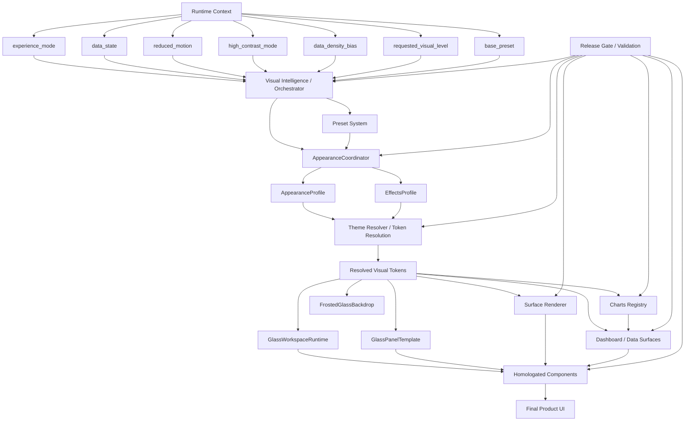

# ✨ code-atlas
### A governed visual operating layer for premium PySide6 applications

<p align="center">
  
  
  
  
</p>

<p align="center">
  <b>Not a theme.</b>
  <b>Not a widget zoo.</b>
  <b>Not a styling side quest.</b>
</p>

<p align="center">
  <b>code-atlas</b> is a contract-driven visual operating layer for building premium, deterministic, and governable desktop interfaces in PySide6.
</p>

---

## 🌌 What this is

code-atlas exists to make sure a UI can be:

- **beautiful** without becoming ornamental fog
- **premium** without becoming loud
- **adaptive** without becoming random
- **expressive** without breaking trust
- **scalable** without turning into Frankenstein with rounded corners

This system provides a shared visual language for:

- shell layout
- components
- surfaces
- backdrop and atmosphere
- motion
- effects
- charts
- dashboards
- validation and release quality

In other words:

> **code-atlas is an operating layer for visual behavior, not just visual decoration.**

---

## 🎯 Core promises

<table>
  <tr>
    <td width="50%">
      <h3>🧠 Orchestration</h3>
      A central brain decides how the interface should behave visually under real context.
    </td>
    <td width="50%">
      <h3>🧩 Homologation</h3>
      Components and surfaces follow shared contracts instead of improvising their identity locally.
    </td>
  </tr>
  <tr>
    <td width="50%">
      <h3>🎛 Tokenized appearance</h3>
      Final visual values are resolved through profiles, effects, and tokens instead of scattered styling hacks.
    </td>
    <td width="50%">
      <h3>🌫 Controlled atmosphere</h3>
      Blur, noise, glow, depth, and backdrop motion are allowed, but they remain disciplined.
    </td>
  </tr>
  <tr>
    <td width="50%">
      <h3>📊 Truthful data surfaces</h3>
      Charts and dashboards stay readable, state-aware, and honest about freshness, emptiness, and error.
    </td>
    <td width="50%">
      <h3>🛡 Governance</h3>
      Anti-patterns, visual drift, and rogue implementations are caught through validation and release gates.
    </td>
  </tr>
</table>

---

## 🏗 Architecture at a glance



---

## ⚙️ Runtime flow

```text
Runtime Context
→ Visual Intelligence
→ Appearance Coordination
→ Profile / Effects Resolution
→ Token Resolution
→ Runtime + Template + Renderer
→ Homologated Components
→ Final Product UI
```

### Read it like a human ☕

The system looks at runtime reality:

- what mode the app is in
- how dense the information is
- whether motion should be reduced
- whether contrast must be elevated
- whether data is fresh, stale, empty, loading, or broken
- what visual level is being requested

Then it chooses a valid visual posture and translates that posture into concrete values that every part of the UI can obey.

No rogue glitter. No local kingdoms. No haunted styling caves.

---

## 🧠 The brain: Orchestration

The visual system is coordinated through:

- `AppearanceCoordinator`
- `AppearanceProfile`
- `EffectsProfile`

These pieces own the authoritative state of the visual system.

They are responsible for:

- applying presets
- updating appearance state
- updating effects state
- producing coherent snapshots
- keeping visual behavior deterministic

### Why this matters

Without orchestration, each screen becomes its own tiny republic with its own spacing, shadows, mood, and drama budget.

That path leads directly to:
- inconsistency
- visual debt
- brittle screens
- “temporary” fixes that fossilize forever

---

## 🪄 Visual Intelligence

This is the adaptive layer that interprets context and decides what visual bundle should be active.

Typical inputs:

- `experience_mode`
- `requested_visual_level`
- `base_preset`
- `reduced_motion`
- `high_contrast_mode`
- `data_density_bias`
- `data_state`

Expected outputs:

- resolved `AppearanceProfile`
- resolved `EffectsProfile`
- selected preset name
- effective visual level
- source metadata for diagnostics and proof

### The real job of intelligence

Visual intelligence does **not** mean freestyle styling.

It means:

> “We are in a dense monitoring workspace, data is stale, motion should stay calm, contrast should rise, and the backdrop should stop trying to be a movie poster.”

That is intelligence.  
Everything else is visual fanfiction.

---

## 🎛 Profiles, effects, and tokens

### `AppearanceProfile`
Defines the core visual posture:

- theme
- density
- typography scale
- animation level
- spacing
- border strength
- blur intensity
- elevation
- breathing room
- density bias

### `EffectsProfile`
Controls the atmospheric and FX envelope:

- glow
- shadow
- highlight
- neon
- softness
- noise
- motion enabled
- backdrop blur

### Token resolution
This layer turns abstract system posture into concrete values such as:

- spacing and padding
- radius and border strength
- opacity and blur
- shadow parameters
- motion duration
- emphasis levels

This is the part that keeps the system honest.

Widgets do **not** get to ask:
> “What random CSS string should I use today?”

They should ask:
> “What tokens describe who I am and how intense I’m allowed to be?”

---

## 🧱 Template, runtime, and renderer

The system becomes real UI through:

- `GlassWorkspaceRuntime`
- `create_visual_runtime(...)`
- `GlassPanelTemplate`
- `surface_renderer`
- `rendering/*`

### `GlassPanelTemplate`
Defines the canonical shell structure:

- `hero`
- `main`
- `side`
- `footer`
- `status`

### `surface_renderer`
Applies treatment using shared contracts such as:

- `visualRole`
- `visualVariant`
- `visualEmphasis`
- `visualFxLevel`

### Why this matters

The renderer is where visual theory stops being a TED talk and starts paying rent.

If contracts are not respected here, the rest of the system becomes elegant paperwork taped to a broken machine.

---

## 🌫 Atmosphere, but on a leash

The backdrop system, centered around `FrostedGlassBackdrop`, provides:

- blur
- soft motion
- glow-adjacent ambience
- depth and atmosphere
- subtle noise and softness

### The rule

The background may breathe.  
It may shimmer a little.  
It may add polish.

It may **not** grab the microphone from the content.

Backdrop is support cast.  
Not lead vocalist.

---

## 📊 Data visualization that tells the truth

Data surfaces are first-class citizens in the system, not dusty admin leftovers.

Important pieces include:

- `DataState`
- `RefreshPolicy`
- `DataResult`
- `DashboardDataSurface`
- `GlassChartPalette`
- `GlassChartStyle`

### Required data states

Every serious data surface must visibly distinguish:

- `loading`
- `ready`
- `empty`
- `error`
- `stale`

### Required trust signals

A good data surface should reveal enough truth to be usable:

- freshness
- state
- diagnostics when relevant
- provider/source context where appropriate
- next-step or recovery path when broken

### The doctrine

A chart may be elegant.  
A dashboard may be premium.  
But if the user cannot tell whether the data is fresh or busted, the UI is lying in a tuxedo.

---

## 🎚 Visual levels

The system supports four official visual levels:

- `performance`
- `standard`
- `premium`
- `showcase`

### Quick reading

| Level | Purpose |
|---|---|
| `performance` | Minimal ornament, maximum clarity and throughput |
| `standard` | Everyday default, balanced and reliable |
| `premium` | Richer tactility, stronger depth, flagship polish |
| `showcase` | Bounded high-expression mode for demos or hero moments |

### Important truth

A visual level is an **envelope**, not a permission slip to do whatever feels cool.

Even `showcase` must still obey:
- contracts
- accessibility
- motion policy
- readability
- product identity

---

## 🎞 Motion policy

Supported motion levels:

- `off`
- `subtle`
- `standard`
- `rich`

Motion is allowed to:

- guide attention
- preserve continuity
- acknowledge change
- support tactile polish
- keep the system feeling alive

Motion is **not** allowed to:

- ignore `reduced_motion`
- hide lag with performance theater
- become the only source of meaning
- keep dancing when the widget is hidden
- turn operator workflows into a light show

In this system, motion should feel precise, calm, and expensive.

Not caffeinated.

---

## 🧾 Contract language

All visible first-class surfaces must participate in the shared contract vocabulary:

- `visualRole`
- `visualVariant`
- `visualEmphasis`
- `visualFxLevel`

This is the grammar that keeps the visual system coherent.

Instead of each component inventing itself from scratch, components declare:

- what they are
- what family they belong to
- how much emphasis they need
- how much FX power they are allowed to consume

This is how a design system stops being a mood board and becomes infrastructure.

---

## 🧩 Component governance

A healthy code-atlas system expects an approved component language.

That means:

- visible surfaces should be wrapped and homologated
- default Qt widgets should not ship as final product identity
- new components must obey contracts
- screen-level visual improvisation should not be normalized

### Best-case outcome

The easiest path is the correct path.

### Worst-case outcome

Every screen author invents their own tab chrome, spacing, shadows, states, charts, and buttons until the product looks like six startups trapped in one trench coat.

---

## 🚫 Anti-patterns

### Styling sins
- hardcoded `setStyleSheet(...)` with final values
- inline hex colors outside token governance
- local blur/shadow/glow decisions with no coordinator awareness

### Component sins
- default Qt widgets used as final product surfaces
- tables and tabs with no homologated skin
- one-off variants invented per screen

### Data sins
- charts with private palettes
- giant KPIs with no timeframe or freshness
- `stale` rendered as if it were `ready`
- empty states that only say “No data”

### Motion sins
- rogue timers
- autoplay loops everywhere
- hidden widgets still animating
- motion that ignores policy

### Architecture sins
- bypassing `AppearanceCoordinator`
- bypassing token resolution
- letting `atlas_*` act as final authority
- “temporary” hacks that become permanent architecture fossils

---

## 📁 Conceptual layout

```text
pyside6_glass/
├─ appearance/
│  ├─ coordinator.py
│  ├─ profile.py
│  ├─ presets.py
│  ├─ tokens.py
│  ├─ intelligence.py
│  └─ levels.py
│
├─ rendering/
│  ├─ glass_painter.py
│  ├─ overlays.py
│  └─ ...
│
├─ runtime.py
├─ visual_runtime.py
├─ theme_resolver.py
├─ surface_renderer.py
├─ backdrop.py
├─ contracts.py
├─ visual_contracts.py
├─ effects.py
├─ charts.py
├─ dashboard.py
├─ data.py
├─ release_gate.py
│
└─ legacy/
   ├─ atlas_styles.py
   └─ atlas_theme_bridge.py
```

---

## 🧪 Quality model

### Technical validation
The system should verify that:

- contracts exist where required
- token resolution is actually used
- appearance is coordinator-driven
- charts use registered styles
- motion respects accessibility
- data states are visually distinct
- legacy modules are not acting as final authority

### Visual QA
The system should also verify that:

- hierarchy is clear
- components look like one family
- motion is coherent
- backdrop stays secondary
- dashboards remain truthful
- premium does not become gaudy
- performance mode does not look abandoned

---

## 🛠 Extension rules

### Add a component
A new component should:

- declare its contract vocabulary
- consume tokens
- support proper states
- belong to the homologated language
- pass acceptance criteria

### Add a preset
A new preset should:

- configure profile + effects
- preserve identity
- obey accessibility
- stay bounded by visual levels
- remain testable and traceable

### Add a chart style
A new chart style should:

- use a registered palette
- have a semantic purpose
- remain readable
- fit the system language
- preserve data truthfulness

### Add a visual effect
A new effect should:

- flow through the effects system
- be disable-able
- be bounded by contracts and accessibility
- never exist as a weird one-off flourish inside a random widget

---

## 💡 Design philosophy

code-atlas is built on one stubborn idea:

> **A premium UI is not one that shouts louder. It is one that stays coherent under pressure.**

That means the framework values:

- hierarchy over spectacle
- clarity over chaos
- contracts over improvisation
- trust over dashboard cosplay
- orchestration over local hacks
- identity over borrowed aesthetics

---

## ✅ Definition of done

A code-atlas implementation is healthy when:

- visual decisions flow through orchestration
- token resolution owns final values
- components obey contracts
- charts obey registry rules
- dashboards tell the truth
- motion obeys policy
- atmosphere supports the content
- validation catches regressions before release

---

## 🪞 One-line summary

> **code-atlas is a contract-driven visual operating system for PySide6, combining orchestration, tokenized appearance, controlled effects, homologated components, truthful data surfaces, and release-gated governance.**

---

## 🌮 Chilango summary

> Es un sistema operativo visual para que la app se vea chingona, se comporte con disciplina y no termine pareciendo tianguis de widgets con blur.

---
