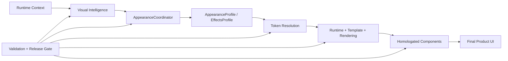
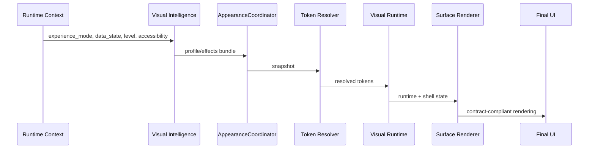

# 🏗 Architecture
### PySide6 Glass system structure and runtime behavior

---

## 🌠 Big picture

PySide6 Glass is built as a **governed visual stack**, not as a loose bag of helpers.

Its purpose is to turn runtime context into a coherent, premium, contract-compliant interface through a deterministic chain of orchestration, token resolution, rendering, and validation.

---

## 🧠 Layer 1: Runtime context

The system begins with runtime reality.

Typical inputs include:

- `experience_mode`
- `requested_visual_level`
- `base_preset`
- `data_state`
- `reduced_motion`
- `high_contrast_mode`
- `data_density_bias`

This layer does not style anything directly.  
It supplies the facts that the rest of the system must respond to.

---

## 🪄 Layer 2: Visual intelligence

The intelligence layer interprets context and decides what visual posture is appropriate.

Primary responsibilities:

- choose or modulate a preset
- derive an effective visual level
- adjust motion posture
- react to data state
- react to accessibility constraints
- produce deterministic visual bundles

Typical output shape:

- `AppearanceProfile`
- `EffectsProfile`
- preset metadata
- effective level metadata

This layer is the strategic brain.  
It decides **what should happen**, not **how pixels are finally painted**.

---

## 🎛 Layer 3: Appearance coordination

The coordinator layer is the system’s authoritative visual state owner.

Key pieces:

- `AppearanceCoordinator`
- `AppearanceProfile`
- `EffectsProfile`

Responsibilities:

- receive preset/intelligence updates
- keep appearance state centralized
- emit snapshots
- ensure state transitions stay coherent
- prevent local visual freelancing

This layer is where intention becomes governable state.

---

## 🧮 Layer 4: Token resolution

Token resolution translates abstract profile/effects state into concrete, reusable visual values.

Examples of resolved outputs:

- spacing scale
- padding
- corner radius
- border strength
- blur intensity
- opacity
- shadow parameters
- motion duration
- emphasis intensity

This is one of the most important architectural boundaries in the system.

Without token resolution, every component becomes tempted to hardcode its own feelings.

---

## 🧱 Layer 5: Runtime + shell template

This is where the system becomes a real application shell.

Key pieces:

- `GlassWorkspaceRuntime`
- `create_visual_runtime(...)`
- `GlassPanelTemplate`

The canonical shell structure includes:

- `hero`
- `main`
- `side`
- `footer`
- `status`

The template provides spatial grammar.  
It defines how premium surfaces relate to each other in a predictable and extensible layout.

---

## 🎨 Layer 6: Rendering system

Rendering is where contracts and tokens become visible surface behavior.

Key pieces:

- `rendering/glass_painter.py`
- `rendering/overlays.py`
- `rendering/surface_renderer.py`

The renderer is expected to consume the full visual contract language:

- `visualRole`
- `visualVariant`
- `visualEmphasis`
- `visualFxLevel`

The renderer is not allowed to invent a parallel styling world.
Its job is to execute the governed system, not bypass it.

---

## 🌫 Layer 7: Backdrop and atmosphere

Backdrop is an atmospheric subsystem, not the center of the product.

Primary reference:
- `FrostedGlassBackdrop`

Expected behaviors:

- blur
- subtle depth
- restrained motion
- premium ambience
- legibility protection

Backdrop may breathe.  
Backdrop may glow softly.  
Backdrop may not upstage the content.

---

## 📊 Layer 8: Data surfaces and charts

Data visualization is a first-class architectural citizen.

Important elements:

- `DataState`
- `RefreshPolicy`
- `DataResult`
- `DashboardDataSurface`
- `GlassChartPalette`
- `GlassChartStyle`

This layer must handle:

- `loading`
- `ready`
- `empty`
- `error`
- `stale`

And it must do so without sacrificing either:

- truthfulness
- visual coherence

Charts must be registry-driven.  
Dashboards must reveal trust signals.  
Pretty lies are not allowed in this neighborhood.

---

## 🧪 Layer 9: Validation and release gate

This layer protects the rest of the architecture from entropy.

Primary pieces:

- `validation.py`
- `release_gate.py`

Responsibilities:

- detect anti-patterns
- enforce contract discipline
- protect capability contracts
- confirm compile sanity
- run critical tests
- optionally run proof flows
- emit evidence artifacts

This is where the architecture gains a spine.

---

## 🧩 Cross-cutting contracts

A few ideas cut across almost every layer.

### Contract vocabulary
The entire stack is shaped by:

- `visualRole`
- `visualVariant`
- `visualEmphasis`
- `visualFxLevel`

### Visual levels
The official envelopes are:

- `performance`
- `standard`
- `premium`
- `showcase`

### Motion levels
The official motion levels are:

- `off`
- `subtle`
- `standard`
- `rich`

### Data truth model
The official dashboard state grammar includes:

- `loading`
- `ready`
- `empty`
- `error`
- `stale`

These are not decorative ideas.
They are architectural commitments.

---

## 🔁 Runtime sequence

A simplified runtime sequence looks like this:

---

## 🧱 Why this architecture works

This architecture is strong because it separates concerns cleanly:

- **context** decides what is happening
- **intelligence** decides what posture is appropriate
- **coordinator** owns state
- **tokens** normalize concrete values
- **template/runtime** define structure and flow
- **renderer** applies governed visuals
- **validation/gate** protect the whole machine

The result is a UI stack that can evolve without turning into a haunted manor full of one-off patches.

---

## 🚫 Architectural failure modes to avoid

### 1. Local style rule empires
When widgets decide final appearance locally, the architecture loses authority.

### 2. Parallel visual systems
If a second styling path emerges beside coordinator/tokens, the package splits its personality.

### 3. Atmospheric overreach
If backdrop becomes louder than content, the architecture fails the product.

### 4. Truthless dashboards
If charts and metrics look premium but hide state/freshness, trust collapses.

### 5. Validation theater
If the gate looks impressive but does not actually protect invariants, the architecture rots quietly.

---

## 🪙 Architectural principle in one sentence

> **PySide6 Glass turns visual quality into a system property rather than a screen-by-screen act of heroism.**
